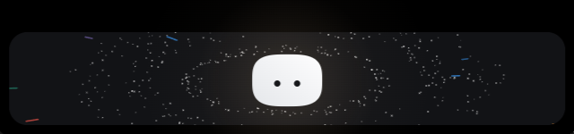
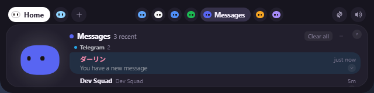
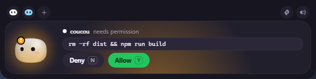
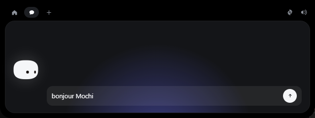
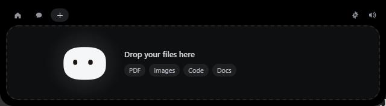
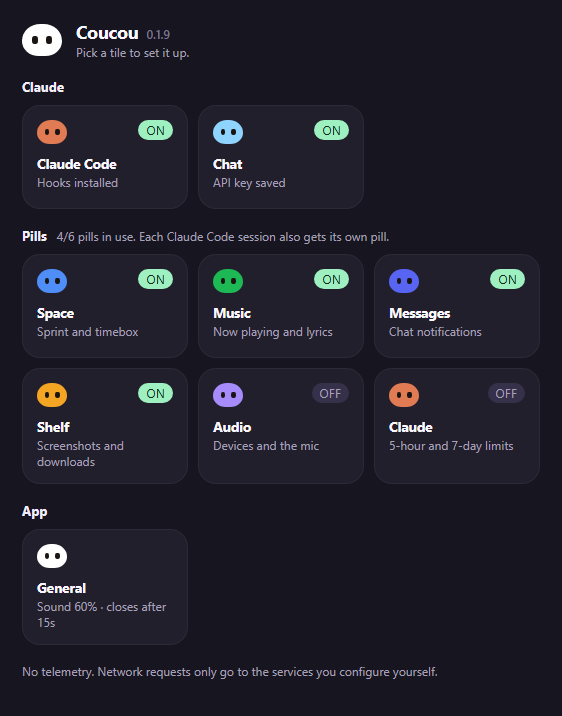

<div align="center">


# Coucou for Windows

**Mochi doesn't get a notch on a PC — so it lives at the top of your screen instead.**

Approve Claude Code permissions, watch your session work, drop a file, chat with Claude, keep an eye on your services — without leaving what you're doing.


</div>



---

## Install

The downloadable installer is **temporarily unavailable**. Microsoft Defender
wrongly flags the unsigned installer as malware (`Trojan:Win32/Wacatac.H!ml`, a
machine-learning false positive). A report is under review at Microsoft, and the
installer will be published again once it is cleared and code-signed.

Until then, [build it yourself](#build-it-yourself): it takes a few minutes and
installs for the current user only — no admin prompt.

## Using it







| What you do | What happens |
|---|---|
| Move the mouse to the very top-centre of the screen | The island opens, no click needed |
| Move the mouse there while a fullscreen game, video or presentation is in front | Nothing: hovering never opens Mochi over it (click the top-centre to open on purpose). New messages wait as a badge too |
| Move the pointer off the island | It closes at once. The chat and anything that opened on its own (a finished session) wait for **Auto-close** instead; a permission request stays until answered |
| Click Mochi | It gets annoyed. Three times in a row and it goes dizzy |
| Rest the pointer on Mochi for two seconds | Hearts |
| Drag a file onto the island | Mochi turns into a box, swallows it, then offers to answer questions about it |
| `Esc` | Closes the island |
| Tray icon | Open, Settings…, Pause, Quit |

Everything else happens on its own: a Claude Code permission request opens the
island with **Deny / Allow**, a finished session shows what it did, and
your integrations sit in the coloured pills next to Mochi.

## Claude Code



Open **Settings… → Claude Code → Install hooks…**. You get the exact diff of what
will change in `%USERPROFILE%\.claude\settings.json`, the path of the dated backup
that will be taken, and nothing is written until you click. Your own hooks are
never touched, and uninstalling removes only Coucou's entries.

The relay is a tiny executable, `coucou-hook.exe`, copied to
`%LOCALAPPDATA%\Coucou\bin\` at launch. It is given 300 ms to reach Coucou and
exits cleanly if the app is closed, slow or crashed — **a Claude Code session is
never blocked or slowed down by Coucou.** If nobody answers a permission request
in time, Coucou stays quiet and Claude Code asks in the terminal as usual.

It works from any terminal — Windows Terminal, PowerShell, VS Code, Git Bash.

### Plans and questions

- **Plan approval (ExitPlanMode).** The island shows the plan itself (scrollable)
  with the terminal's choices: **Yes, bypass**, **Yes, accept edits**, **Yes,
  manual** (approve each edit), and **Change plan…**, which sends your note back
  to Claude so it keeps planning. Approving switches the session's permission
  mode through `updatedPermissions` (`setMode`, destination `session`); when
  Claude Code's own `permission_suggestions` carry that mode, its entry is used
  as is.
- **Questions (AskUserQuestion).** Each question shows its options as chips
  (descriptions on hover), one question at a time with an `i/N` counter.
  Multi-select questions toggle chips then **Next / Send**; **Other…** takes free
  text; **Reply in terminal** closes the card and leaves the terminal dialog.
- **Answer in either place.** The terminal dialog and the island card are up at
  the same time (both come from the same `PermissionRequest`); whichever is
  answered first wins.
  - Answered on the island: the relay returns the decision and the terminal
    dialog closes.
  - Answered in the terminal: Claude Code aborts the hook, the relay's pipe
    closes, Coucou sees it (`hook-gone`) and takes the card down within about
    2 s. As a backstop, the session moving on (the tool runs, a new prompt, Stop)
    also clears a leftover card.
- **Why `updatedInput`.** ExitPlanMode and AskUserQuestion require user
  interaction: Claude Code ignores a hook's plain `allow` for them and keeps
  waiting on the terminal. The relay therefore always answers them with
  `updatedInput`: the plan input unchanged, or the questions plus `answers`.
  This was verified against CLI 2.1.289 through the Agent SDK. Without it, a
  plan approved on the island left the terminal still asking.
- Older builds installed a separate `PreToolUse` `--ask` hook for
  AskUserQuestion. Installing or updating the hooks removes it.
- The island answers the relay with one line: `allow` / `deny`, or JSON
  `{"plan":"<mode>"}`, `{"feedback":"…"}`, `{"answers":{…}}`. Anything else is
  dropped and the terminal asks, so a bad line can never approve or deny.
- Plans are forwarded up to 64 KB; every other string in a hook payload is still
  capped at 2,000 characters.

## Chat and keys

**Settings… → Claude** takes your Anthropic API key. Keys live in the **Windows
Credential Manager**, never on disk and never in the interface — the island can
only ask whether a key exists. Same for every integration key.

### Chat with your Claude Code login instead of a key

**Settings… → Claude → Chat via → Claude Code login** runs each chat turn
through the Claude Code CLI (`claude -p`), signed in with your own Claude Code
account, so no API key is needed and the chat uses your subscription.

- Coucou never reads or reuses the Claude Code OAuth token. Claude Code talks to
  Anthropic; Coucou only hands it the prompt on stdin and reads the JSON reply.
- **Config dir** is the `CLAUDE_CONFIG_DIR` handed to the CLI. Leave it empty for
  the default `%USERPROFILE%\.claude`; set it (e.g. `C:\Users\you\.claude-work`)
  if the account you want lives in another profile.
- Runs use `--setting-sources ""`, so your `settings.json` (and Coucou's own
  hooks in it) stays out: chat turns never show up in the island as Claude Code
  sessions.
- Tools are limited to `WebSearch`, `WebFetch` and `Read` (for a dropped file).
  Nothing that edits files or runs commands.
- Turns continue with `--resume <session id>`. As with the API chat, the
  conversation lasts until a file is dropped or Coucou restarts. Sessions are kept under the profile's `projects`
  folder for `%LOCALAPPDATA%\Coucou\chat`, out of your projects' `/resume` lists.
- Each turn starts the CLI, so expect a few seconds more than the API path.
  `coucou.log` gets `chat via claude-cli ok (<ms> ms)` or the error.
- `claude` is found on `PATH`, else in `%USERPROFILE%\.local\bin`.

Tests: `cargo test --lib` covers argument building and output parsing. The
live eval runs two real turns and checks the second remembers the first:
`cargo test --lib claude_cli_live -- --ignored --nocapture` (set
`COUCOU_CLAUDE_CONFIG_DIR` to test another profile).

## Personal pills (this build)

This build hides the stock integrations (Stripe, GitHub, Vercel, n8n, Resend,
Notion, Cal.com: their code stays, so upstream still merges) and shows pills
that read only what is already on this PC. No keys, no new accounts. The one
network call is the Music pill's lyrics (lrclib.net), which Settings can turn off.

| Pill | Source | Refresh |
|---|---|---|
| One per **Claude Code session** | hook events, by `session_id` (`cc_<8 hex>`), named after the project folder | live |
| **Claude** (usage, off by default) | `%LOCALAPPDATA%\Coucou\status\<session_id>.json`, written by the Claude Code status line | 5 s |
| **Space** | `list_timebox` on the local `space-timebox` MCP server, over stdio, no LLM | 5 min |
| **Music** | Windows media session (Spotify, browsers, any player); lyrics from [LRCLIB](https://lrclib.net) | 2 s |
| **Messages** | Windows notifications from Discord, Slack, Telegram, WhatsApp | 3 s |
| **Shelf** | Files dropped on Mochi (by reference), the Screenshots and Downloads folders | 3 s |
| **Audio** | Core Audio (devices, volume, mute) and the microphone privacy registry | 2 s |

- **One pill at a time.** The overview shows a single pill, full width. The
  header shows one dot per pill in that pill's colour, a ring on any with news,
  and the active pill's name. Two-finger swipe (or tilt wheel), drag the card
  left/right, ← →, or tap a dot to move between pills.
- **Sessions.** Every Claude Code session gets its own pill with its ticker,
  context % and cost. A permission request, plan or question focuses the
  session that asked. `SessionEnd` removes the pill after 5 s, and sessions
  quiet for 2 h are swept. The catch-all Claude Code pill only shows while no
  session exists.
- **Claude usage.** The status line script (`statusline.js` in the Claude Code
  config folder) calls `statusline-coucou.js`, which writes the 5h/7d limits,
  context and cost atomically per session. Files older than 24 h are deleted and
  limits whose reset time has passed are ignored. The pill sweats at 90 % of the
  5-hour limit and raises an alert at 80 % and 95 %.
- **Space.** Runs `uv --directory <space-timebox> run space-timebox serve` and
  calls `list_timebox` for today: points done/total, sprint (SP) vs timebox (TB)
  items, and the `/point` rules as warnings (total ≠ 8, open items at 0 pt).
  The card lists every task in a list that scrolls (3½ rows visible, 2½ when a
  warning shows), open tasks first and done ones after with a green ✓ on the
  right (`views/spaceTasks.ts`); the scroll position survives the 5-minute refresh.
  Login stays with space-timebox (`space-timebox login`); its errors are shown as is.
  The folder is set in **Settings → Integrations → Space** (empty = default).
- **Music.** Prefers a playing session, then Spotify. ⏮ ⏯ ⏭ act on the same
  session. The card has two columns, in the same height as every other card.
  On the left: the cover (with a soft glow of it behind), the title and the
  artist on their own lines, the controls under them, and the progress with
  its times. On the right, past a thin divider: three synced lyric lines, the
  one being sung in the middle (larger, wrapping once before it ellipsizes),
  the one before and the one after, dimmed. With lyrics off in Settings the
  left column takes the whole card. `dev/music-card-preview.html` renders it in
  a plain browser with a fake song (`?long`, `?nolyrics`). The lyrics button
  (or a click on the lines) opens every line, the sung one centred. The cover
  is read once per song (a few times more to catch Spotify's late swap) and
  fetched with `media_art`, never resent with the 2 s poll. The poll only
  reaches the island when something changes (`media::same_media` ignores the
  player re-reporting its position); the island moves the bar and the lyrics
  itself with a 250 ms timer that only runs while a song plays on screen.
  Collapsed with the Music pill in focus and a song playing, the island widens
  and sings the current line, centred, instead of showing the other pills (the
  song's title and artist during the intro and the gaps). A line longer than
  the island grows it to fit, up to the window's width, where it ellipsizes;
  short lines leave it at its base width so it does not jump on every line
  (`stripIslandWidth` in `views/lyrics.ts`). While the song plays the compact
  island does not auto-hide (the FSM's `keepPetit`), except over a fullscreen
  game, video or presentation, and a song starting on the Music pill brings
  it back if it had hidden.
- **Mochi's acts.** Each personal pill has a themed animation, played only
  on a real event (`mochi/acts.ts`, tested in `tests/acts.test.ts` and
  `tests/dance.test.ts`):

  | Pill | Trigger | Act |
  |---|---|---|
  | Music | the pill is `working` (a song plays) | headphones, dances at a fixed 112 BPM (Spotify closed its tempo API), music notes |
  | Audio | `micUsers` is not empty (an app uses the mic) | call headset with a boom mic, nods as if talking, sound waves; red mic, no waves, while the mic is muted |
  | Messages | the pill's `event` (a new toast, never the backlog) | an envelope pops up, surprised hop, the flap opens on a letter, hearts (3.2 s) |
  | Shelf | a file not on the shelf before, or saved again (screenshots, downloads, pins) | a box on the head, looks up, a sheet falls in, wobble, sparks (2.6 s) |
  | Space | the done count goes up (one poll every 5 minutes) | hard hat and clipboard, the check mark draws itself, proud hop; star eyes and confetti when every item is done (2.8 s / 3.6 s) |

  Only Messages sends an `event`, so `detectAct` compares each update with the
  pill's previous data in `island/integrations.ts`. The first data after a
  launch is the backlog and never plays, and files leaving the shelf (the
  3-day window, an unpin) never count. A one-shot is stored on the pill
  (`AgentTask.act`, with its start time); `actFor` gives a live one-shot
  priority, then a continuous act (Music, Audio). The island and the pill
  minis ask it every frame, so a one-shot ends on time.
  `BotEngine` draws every prop in code and adds the act's pose on top of its
  own animation, so a slap or an emote still plays over it. A one-shot drops
  the "finished" eye roll it arrives with. Swapping acts fades the old one
  out, then the new one in. The Music groove eases in and out over about a
  second. One-shots pop their props in and fade their pose back to neutral at
  the end. The props replace the state badge, which would sit under them.
  Props held in front of the face must never cover the eyes: the envelope is
  held low, at the bottom edge of the body, and its sizes live in
  `mochi/geometry.ts` next to the eye constants. During the act Mochi stops
  looking down at the cursor (`actPitchFloor`), which would drop the eyes into
  it. `tests/geometry.test.ts` checks every frame of the act against the
  lowest the eyes can reach (level head, surprised eye pop). Minis play the acts too, without hands or particles. Nothing runs while the
  island is hidden (the frame loop's hidden gate). `dev/acts-preview.html`
  shows every act side by side with `npm run dev`; one-shots loop, and
  `?t=<seconds>` freezes them at that age (the page title then lists each
  engine's act and age). In dev, a Vite page reload wipes the pills' data and
  Rust only re-sends a pill when it changes, so the first change after a
  reload counts as a first load and plays nothing.
- **Lyrics.** `lyrics.rs` asks LRCLIB's exact match (title, artist, album,
  length) and stops there only when it is synced and within 2 s of the song.
  Otherwise it searches (as reported, with "feat."/"Remastered" noise
  stripped, then free text) until a record is, and picks from everything it
  saw: a length within 3 s first, then synced over plain over instrumental,
  then the closest length. Results, "not found" included, are cached for the
  run; network errors are retried 30 s later.
- **Romanization.** Japanese, Korean and Chinese lyrics get a Latin version,
  switched with the **Aa** button on the card or the lyrics detail (remembered
  in settings, applies to the card, the detail and the collapsed island).
  `romanize.rs` decides the song's language from all its lines (any kana makes
  kanji Japanese) and works offline: Korean is Revised Romanization computed
  from the Hangul block (liaison, nasalization, ㄹ and ㅎ rules); Japanese is
  romaji from the readings of the IPADIC dictionary embedded with `lindera`
  (particles は/へ/を as wa/e/o, inflections joined to their word, a short list
  of number words it misreads); Chinese is pinyin with tone marks (`pinyin`
  crate, one syllable per character, so a character with two readings can get
  the wrong one). The embedded dictionary makes the release binary about
  46 MB larger, and the first build downloads it from lindera.dev.
- **Wrong lyrics.** The 🔍 button in the lyrics detail (or "Search lyrics by
  hand" when none were found) opens a search box prefilled with the title and
  first artist. Rows come best first, with the length in green (same, ≤ 2 s),
  amber (≤ 3 s) or grey (another recording) and a synced/plain badge. Clicking
  one uses it for this song from now on, remembered in `lyrics-choices.json`
  next to `settings.json` (newest 500 songs); **Auto** forgets the pick. The
  box takes the keyboard only when clicked; ← → and Esc act on it, not on the
  island. Only the title, artist, album and
  length leave the PC, nothing reaches the log, and nothing is sent while
  **Settings → Integrations → Music → Lyrics** is off or Coucou is paused.
- **Shelf.** Took the Claude usage pill's place (a one-time settings
  migration, `settings.rs migrate_pills`, also adds Audio; up to six pills can
  be on). Three tabs: files kept on the shelf (dropped on Mochi while the Shelf
  pill is open, or with **Keep on shelf** on the drop's choose card; kept by
  reference in `shelf.json`, never copied or moved, gone from the shelf when
  the file is), and the newest screenshots and downloads of the last 3 days
  (partial downloads and system files skipped). Tiles show Explorer's own
  thumbnail or icon (`IShellItemImageFactory` → WIC PNG, cached). Click opens
  the file; press and move drags the real file out to any app (the `drag`
  crate's OLE DoDragDrop, started from a Win32 timer on the island window so
  its modal loop never runs inside tao's event handler, which crashed);
  hover buttons copy it (as a file, and as a picture for images), show it in
  Explorer, or take it off the shelf. Every action only accepts a path the
  card shows. While a file is dragged over the open Shelf pill, the card's
  edge lights up.
- **Dropping files on the island.** WebView2 takes the drop, like Edge does
  (`webdrop.rs`): external drops are allowed on its controller, the page sees
  plain HTML5 drag events (`core/bridge.ts` watchPageDrops), and on drop
  posts the File objects with `chrome.webview.postMessageWithAdditionalObjects`;
  Rust reads each `ICoreWebView2File`'s real path and sends them back as
  `island-drop`. A drag from File Explorer never reached an OLE drop target in
  Coucou's own process on Windows 11 (wry's, or one of ours), even with the
  target found under the cursor, which is why dropping on Mochi used to show
  the "no entry" cursor.
- **Audio.** Speaker and microphone rows: the icon mutes, the name opens the
  device list (sets the default for every role through `IPolicyConfig`, the
  Sound control panel's own interface), the slider sets the volume (patched in
  place, so a poll never rebuilds the card under the pointer). Which apps use
  the microphone comes from the privacy registry
  (`CapabilityAccessManager\ConsentStore\microphone`); noise-removal apps
  that hold the mic all day (NVIDIA Broadcast, Krisp, VoiceMeeter…) do not
  count. While an app records, the open island's header shows a mic button
  (one click mutes or unmutes, from any pill) and the collapsed island a red
  badge (grey when muted).
- **Claude usage, off.** Its poller still runs (it only reads local files):
  session pills keep their context and cost, and a 5-hour limit alert goes to
  the most recent Claude Code session pill (`island/quotaAlert.ts`).
- **Messages.** Reads Action Center toasts through `UserNotificationListener`
  (Windows asks once for notification access). Shows sender, message,
  server/workspace and channel; clicking a row opens the app. The card groups
  messages by app (the app with the newest message first, `views/messageGroups.ts`)
  in a list that scrolls, and goes back to the top when news comes in. Each
  message reads like an Android notification: sender and channel on top, the
  text below on one line; long or multi-line text gets a chevron that expands
  and collapses it (the state survives the card's refreshes). A new
  message opens the island on the Messages pill for a 3-second glance (the
  countdown bar shows it) and then collapses; hovering keeps it open to read.
  When the island closes, the focus goes back to the pill the message took it
  from, unless you moved to another pill yourself meanwhile
  (`focusAfterGlance` in `island/messageAlert.ts`).
  It never takes the island from an approval, a question, the chat or a
  pointer already in it (`island/messageAlert.ts`). Clicking a message (or an
  app's heading) opens the app and takes those messages off the card; **Clear
  all** empties it. A cleared message never comes back: the listener has already
  seen its toast. Slack toasts never
  name the workspace, so it comes from **Settings → Slack workspace**. Messages
  stay in memory (the last 15), and the log records counts only. A toast an app
  clears before the next poll (3 s) is not seen. Discord's toast format is
  parsed as `Author (#channel, Server)`; adjust `notify.rs` if a live toast differs.

Tests: `cargo test -p coucou --lib` (parsers, MCP framing, quota files, Space
summary, session routing) and `npm test`. Live evals, counts only, never content:
`cargo test -p coucou --lib live -- --ignored --nocapture`.

No telemetry. The only network requests Coucou makes are to the services you
configure yourself.

## Build it yourself

You need [Rust](https://rustup.rs), [Node 20+](https://nodejs.org), and the
**MSVC build tools** (Visual Studio Build Tools with "Desktop development with
C++"). WebView2 ships with Windows 10/11.

```powershell
cd windows
npm install
npm run tauri dev      # live-reloading development build
npm run pack           # builds the installer and drops it in windows/release/
```

`npm run dev` alone serves the front end in an ordinary browser, which is enough
to work on the island's looks. It also serves `dev/upload-preview.html`, which
replays the whole file-drop choreography on a loop — the one part of the UI that
otherwise needs a real drag from Explorer to see. Neither page ships in the app.

`npm run pack` leaves two files in `windows/release/`, the same names the release
workflow publishes:

```
Coucou-Windows-X.Y.Z-setup.exe    the versioned installer
Coucou-Windows-setup.exe          the same file under the rolling name
```

Installing is optional — `target/release/coucou.exe` runs on its own. There is no
window in the taskbar and no console: the island at the top of the screen and the
Mochi in the notification area are the whole app, and Quit lives in its menu.

The 28 sounds are the macOS app's own files; they are never duplicated in this
folder. The path is declared once, in `SOUNDS_DIR` at the top of
`vite.config.ts` — when they move to `shared/sounds/`, change that one line.

### Patched Tauri runtime

`patches/tauri-runtime-wry/` is Tauri's `tauri-runtime-wry` 2.12.0 with a single
change, swapped in through `[patch.crates-io]` in `Cargo.toml`. Stock Tauri clones
a non-thread-safe `Rc` whenever an `AppHandle` or a webview is cloned off the main
thread, which the pollers and the cursor thread do all the time. Debug builds
aborted on it (`unsafe precondition(s) violated` in `Rc::inc_strong`); release
builds corrupted memory quietly (tauri-apps/tauri#15408, still open in 2.12.1).
`tauri` is pinned to `=2.12.0` to match, and `src-tauri/src/rc_guard.rs` refuses
to compile if the patch is ever left out. `scripts/rc-stress.ps1` checks it at
runtime: 4 threads clone the `AppHandle` while the debug build runs (stock: crash;
patched: survives). Before upgrading Tauri, read
`patches/tauri-runtime-wry/PATCH.md`.

The app icon and the tray icon are drawn in code, like Mochi itself:

```powershell
npm run icons          # regenerates src-tauri/icons from scripts/gen-icons.mjs
```

### Layout

```
windows/
  src/                 island front end (TypeScript, no framework)
    mochi/             Mochi and the launch greeting, in Canvas 2D
    island/            state machine, hooks, integrations
    views/             every island view
    settings/          the settings window
  src-tauri/           Rust backend: window, named pipe, Claude API, pollers
  hook/                coucou-hook.exe, the Claude Code relay
  patches/             vendored tauri-runtime-wry with the Rc race fix
  scripts/             icon generator, packaging, rc-stress.ps1
  dev/                 browser previews: upload, Mochi acts, Music card
```

### Log

`%LOCALAPPDATA%\Coucou\coucou.log` — hook events, permission decisions, poller
problems. It stays on your machine.

## What's different from the Mac version

- No notch, so the island lives at the top centre of the screen and retracts into
  the top edge instead of hiding in a notch.
- Permission approval works from **any** terminal; the Mac build only listens to
  VS Code sessions.
- Not in this version: sending a file by email, dragging Mochi onto a window to
  attach it as context, and jumping to a specific terminal window — "Open
  terminal" opens the working folder in VS Code when `code` is on your `PATH`.
- Cal.com shows the next bookings as a list rather than the Mac's calendar.

## Linux

The same app builds for Linux: everything that differs lives in
`src-tauri/src/platform/`, and the relay's transport in `hook/src/unix.rs`.

```bash
sudo apt install build-essential pkg-config \
  libwebkit2gtk-4.1-dev libgtk-layer-shell-dev libayatana-appindicator3-dev \
  librsvg2-dev libssl-dev libdbus-1-dev patchelf \
  gstreamer1.0-plugins-base gstreamer1.0-plugins-good
npm install
npm run tauri dev      # live-reloading development build
npm run pack           # AppImage, .deb and .rpm in windows/release/
```

What changes on Linux:

- **The island** is a gtk-layer-shell overlay anchored to the top edge, over any
  top panel, on compositors that support it: COSMIC, KDE Plasma, Hyprland, Sway
  and other wlroots compositors. GNOME has no layer-shell, so there the island
  is a regular window. `COUCOU_LAYER_SHELL=0` forces that mode anywhere.
- **Click-through** is the window's input region, kept equal to the island
  shape, so the compositor sends every other click to what is underneath.
- **Mochi's eyes** follow the pointer only while it is over the island: Wayland
  gives no app the cursor position anywhere else.
- **Claude Code hooks** go through `~/.local/share/coucou/bin/coucou-hook` and a
  Unix socket at `$XDG_RUNTIME_DIR/coucou.sock`. Both ends check that the other
  runs as the same user.
- **Keys** live in the Secret Service (GNOME Keyring, KWallet).
- **Files**: preferences in `~/.config/coucou/`, the log at
  `~/.local/share/coucou/coucou.log`.
- What the Windows build leaves out, this one does too: sending a file by
  email, dragging Mochi onto a window, and jumping to a specific terminal
  window — "Open terminal" opens the folder in VS Code.
